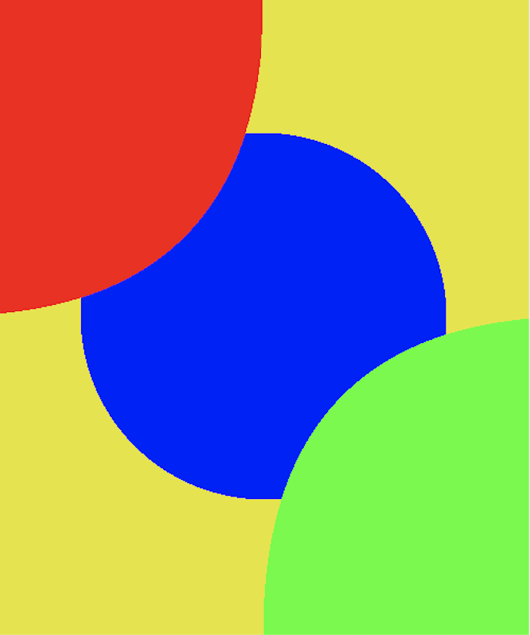
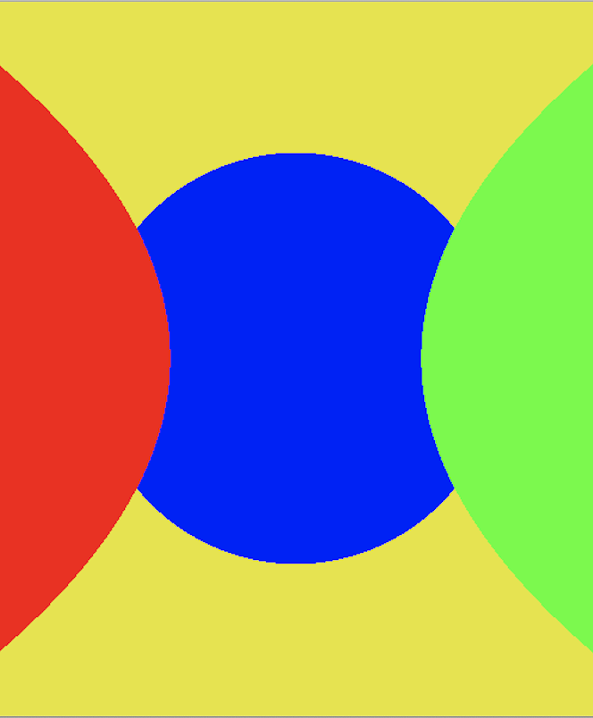
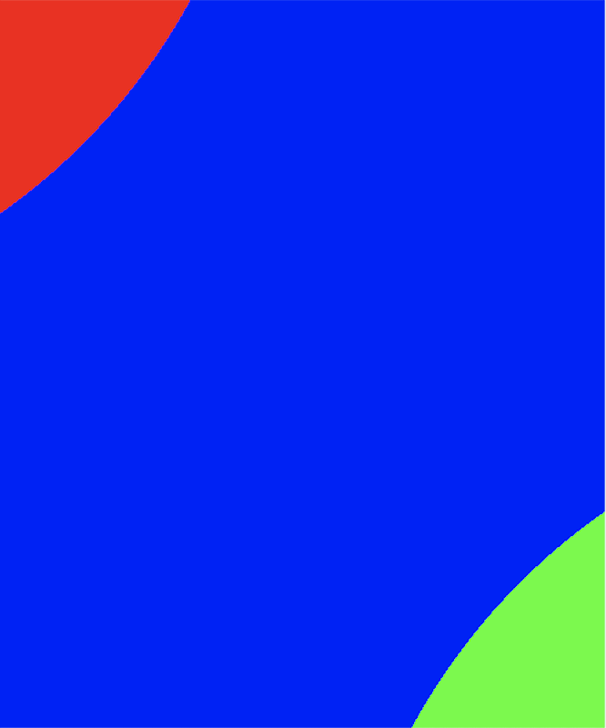
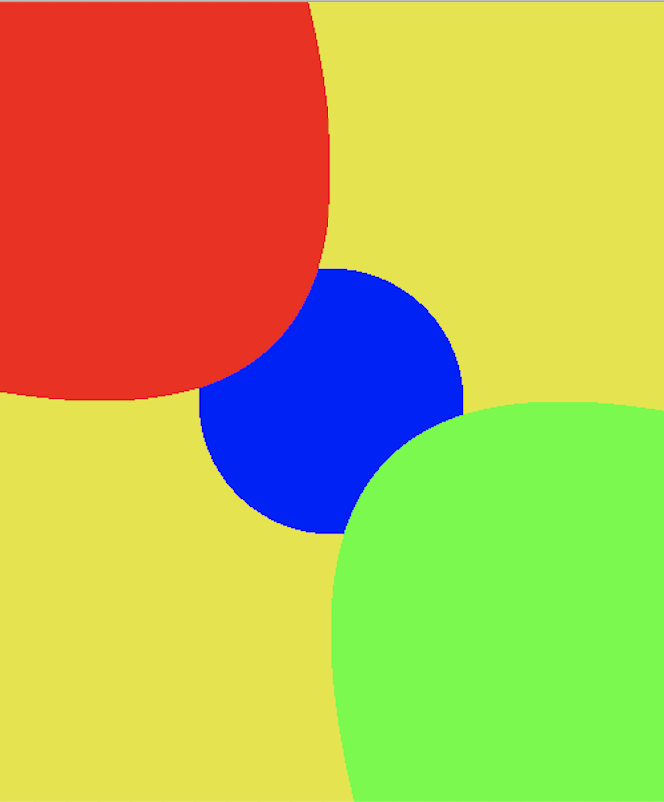
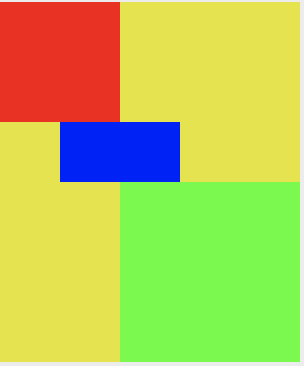
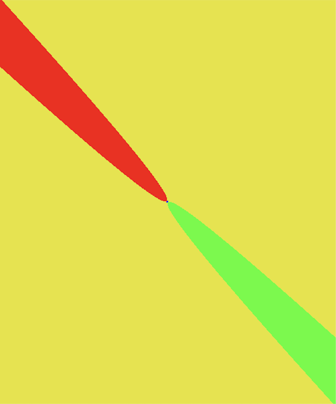

# Assignment 1a

Dongha Kang, kangx637

September 23rd, 2019


## Installation

To compile the program. Simple use make file.
```bash
make all
```
or
```bash
make
```
Once it compiles, compiler generates the object file called **kangx637**. To run the program.
```bash
./kangx637
```


## Write-up
Example will be used with the picture below.

```input.txt
eye  0.0 0.0 0.0
viewdir  0.0 0.0 1.0
updir 0.0 1.0 0.0
vfov  90
imsize 500 600

bkgcolor 0.9 0.9 0.1

mtlcolor 0.0 1.0 0.0
sphere -1.0 -1.0 1.0 1.0
mtlcolor 1.0 0.0 0.0
sphere 1.0 1.0 1.0 1.0
mtlcolor 0.0 0.0 1.0
sphere 0.0 0.0 4.0 2.0
```



### 1. Change of *up* vector.
- By changing the up direction, it might rotate in certain direction. For example, by changing up direction from **0.0 1.0 0.0** to **-1.0 1.0 0.0**, the picture will rotate x direction by *-field of view / 2*. Changing up direction changes camera angle and make it look tilted depend on where up direction is pointing.




### 2. Change of *Field of View*
- By changing Field of view, picture focuses in and focuses out. Lowering the field of view will zoom in and focus the picture more, and Increasing the field of view will zoom out and not only zooming out but focuses out. That makes the picture more cinematic and wide.




### 3. Viewing Parameters
- Distortion can happen many times while using this informations. However, instead of directions and camera position, I personally think that image size and vertical field of view are the two most important parameters that can deal with distortion.
- **image size**: Lower the image size the worse the picture quality. However, Bigger image size will take much more calculation, causing a delay.


- **Vertical Field of View**: Mentioned above this can make picture more wide. However, too much can ruin the picture. Enough Field of View value can make picture more clear.


