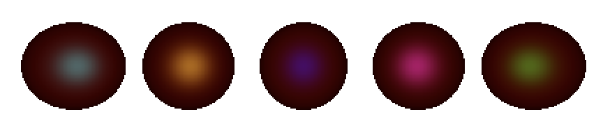
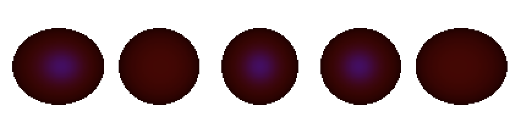

# Assignment 1a

Dongha Kang, kangx637
October 1st, 2019


## Installation

To compile the program. Simple use make file.
```bash
make all
```
or
```bash
make
```
Once it compiles, compiler generates the object file called **kangx637**. To run the program.
Also, you can have one input file here. Followed by ./kangx637.
```bash
./kangx637 <input.txt>
```


## Write-up

### 1. The effects of: ka, kd, ks, n and Osl in addition to Odl
Odl is the material color. Material Color is the base color of the object and by adding these ingredients (ka, kd, ks, n, Osl), the object will look 3 dimensional.

- Ambient: by increasing the Ka (ambient) value, the original color becomes more visual and bright.
In the example below, when Ka is 0 (left) the color becomes dark green and when Ka is 0.8 (right)
the color becomes really bright green. The color becomes more vivid as the value increases.


- Diffuse: Diffuse is more about the surface of the material. As the diffuse value goes up the surface of the sphere becomes more visual. For example, when Kd is 0 (left) it is unable to see the surface of the material where as when Kd is 0.8 (right), you can see more surface structure of the object.


- Specular: Specular deals with lighting. As the specular value increases, the light becomes brighter and absorbs more light. For example, when Ks is 0 (left), you barely see any lighting. However, when Ks is 0.8 (right), you can see more light working on the surface of the object.


- N value: As the N Value increases, it only absorbs small amount of the light or the reflection and specular light highlights. As the N value decreases, it deals more with the surface. For example, when n is small (left), there is more specular light. When n is large (right), there is smaller specular light.


- Specular Color: Reflective light (Specular Light) is the color of the reflection. From left, the specular color is White, Yellow, Red, Pink, Purple.


Therefore, by choosing, ka, kd, ks, n and specular light It sets the surface of the object and decide how light works on each objects cause the object look Three-dimensional.

### 2. The use of a directional light source vs a point light source vs spotlight
Directional Light and Point Light works differently since point light has the limit. By that means point light has the light source and it is defined in the 3D plane. On the other hand, directional light is easier to calculate since it already shows the direction of the light and relationship between the object. (L vector). Directional Light assumes that the light source is infinitely far away.


Spotlight is always the Point Light. The similarity between point light and spotlight is that it has the start point of the light in 3D plane. The difference between point light and spotlight is that spotlight has the degree of an angle. Within the angle, outside of the spotlight angle will appear to be dark.


### 3. The use of multiple lights vs a single light
Multiple Lights Colors often strengthens the brightness of the object and may change how objects' surface looks. Adding light brightens the object is such an obvious statement. The more interesting part is when we add colored lights.
- Color lights X Specular Color.
If the Specular Color matches the light color, or if they have same color in common, It will show the light of the color and light of the specular (not particularly brighter). However, when specular color does not match with light color, it will not have any lighting or have only part of the color. For example, since white light is the sum of all the light colors, specular color remain same.

When light is different from specular color, it only shows the intersection of light color and specular light. Below are three picture that shows different light color (red, blue, green)




- Color Lights X Color lights
By adding different light colors, it can change the color of lights. Below picture can show the addition of light colors. When all different color light adds up together, it creates white colored light.


### 4. The effects of Attenuation
Attenuation enables the intensity of the light. If the light distance is far from the object, it is impossible to see any lights or notice the lights. However, if the distance happens to be very close to the object, it brightens the color dramatically.
Below are the picture of attenuation lights. (attenuation, attenuation spotlight).


### 5. Shadows
Shadows happens when there is object within the L Vector (the light direction from the surface of the object).
What I did was soft shadow, where if the object is in the shadow, the surface of the object shoot 100 more rays randomly that is close to the light source. That will return the ratio of the "hit" of the object, which depends the smooth transition of the shadowed surface to normal surface.
Below is the example of many objects with many shadows.


### 5. Final Product
By using multiple lights with different light colors, spotlights, and adding spheres, it generated this picture !

