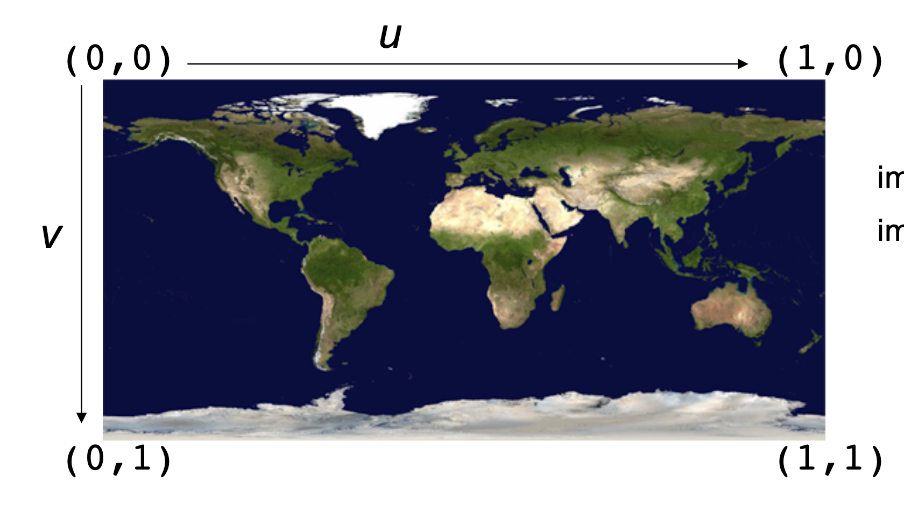

# Assignment 1c

Dongha Kang, kangx637
October 16th, 2019


## Installation

To compile the program. Simple use make file in terminal
```bash
make all
```
or
```bash
make
```
Once it compiles, compiler generates the object file called **kangx637**. To run the program, type ./kangx637 in terminal.
Also, one input file is required.
```bash
./kangx637 <input.txt>
```


## Write-up

For this part of assignment, I generated triangle object. By using triangle objects
I was able to make different type of objects such as cylinder, cube.
This is a simple example that was made with triangle. (cube)


### Shading / Soft Shading
For Triangle objects, it was possible for user to provide the the objects' own vertex normal.
If the users do not give the vertex normal, the program will just calculate the normal of the plane with given three vertices.
On the other side, if the users provide the vertex normal, it is possible to prevent from more angled sshading.

Below is the picture of using NO soft shading (no vertex normal given), and soft shading (vertex normal given).


### Texture Mapping
Assumed that input texture has a texture coordinates the below, where upper left is (0,0), and lower right is (1, 1);


I first stored the pictures' color coordinates in the array and mapped it when they had vt value in *f*.
For example,
```
v 1 1 0
v 1 -1 0
v -1 -1 0
v -1 1 0

vt 0 0
vt 0 1
vt 1 1
vt 1 0

f 1/1 2/2 3/3
f 1/1 3/3 4/4
```
becomes the picture below.


As the object got bigger or the window size got bigger, the texture became more clear.
 


### Parallel Projection
For Parallel instead of having distance between eye and viewing window to be *1.0*, first I made the
distance between eye and viewing window to be ***0.0***.
Also, before parallel, my ray started at my eye with direction being unit vector of *viewing window - eye*.
For Parallel projection, my ray started from viewing window with direction being unit vector of viewing direciton.
The picture will be affected when viewing window size is changed since all the ray starts at the viewing window.
Since changing eye value does not affect too much with viewing window size and location,
changing **vfov** value will affect the view of the parallel projection.
- original picture  


- vfov = 90 degree


- vfov = 120 degree

