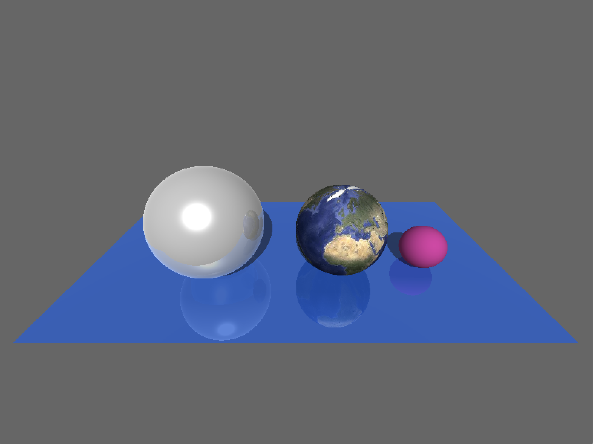
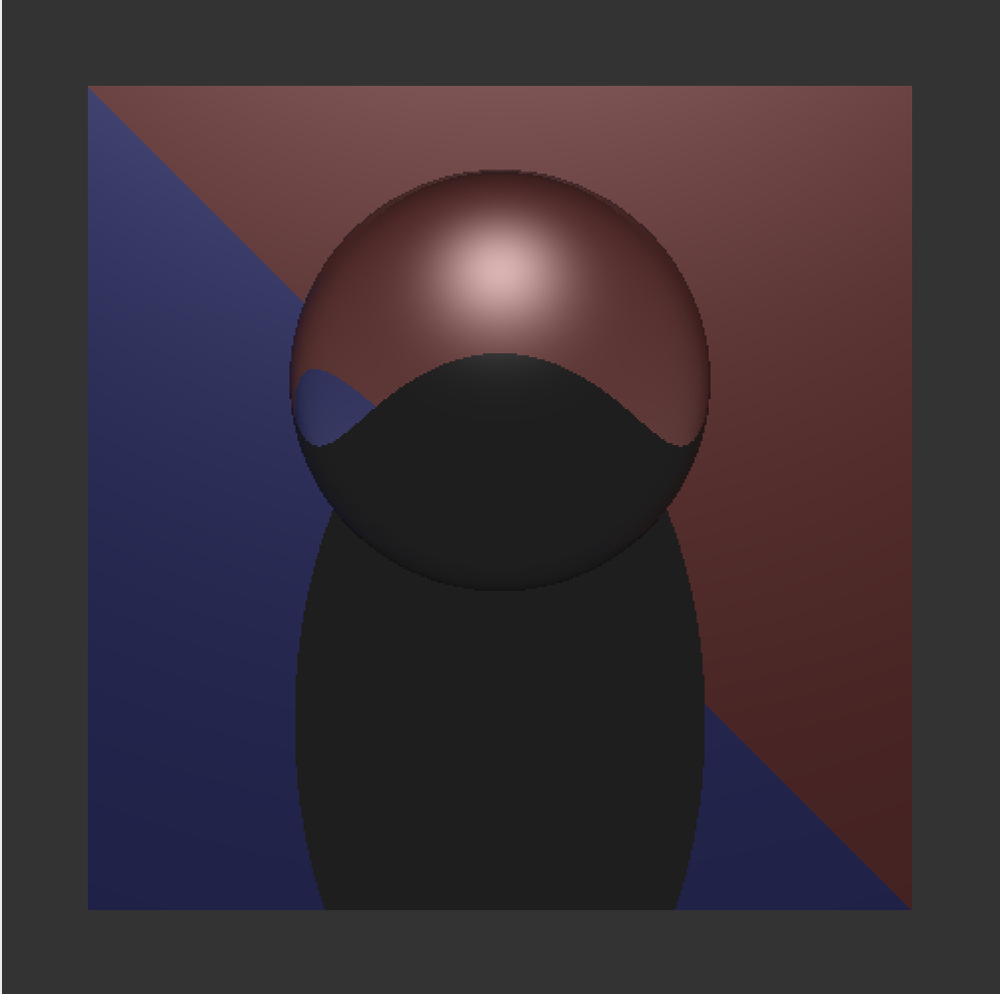
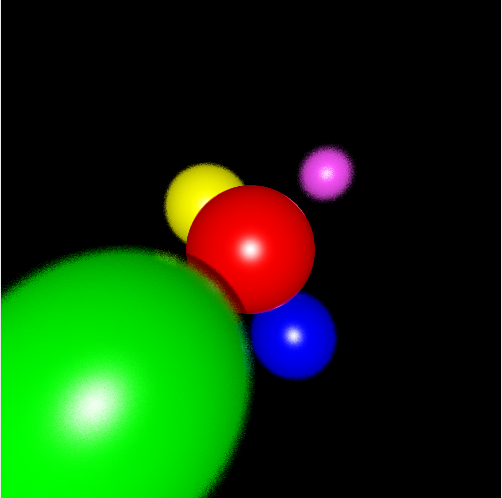

# Assignment 1d

Dongha Kang, kangx637
November 6th, 2019


## Installation

To compile the program. Simple use make file in terminal
```bash
make all
```
or
```bash
make
```
Once it compiles, compiler generates the object file called **kangx637**. To run the program, type ./kangx637 in terminal.
Also, one input file is required.
```bash
./kangx637 <input.txt>
```


## Write-up

For this part of assignment, I generated Refraction, Reflection of the objects and
Depth of Field Effects.


### Reflection
By using recursive function for reflection. It produced a picture below.
Instead of adding the color directly, I multiplied the color with specular variables of the material.


### Refraction
Problems that I had
- if I use only refraction (no reflection). It creates the image that refracts. However, index of refraction value seems to be different

- if I change the index of refraction value. The image seems to be correct except the image has NaN values.


### Depth of Field
By having viewdist value in txt file, it enables the depth of field image. What I did was that I set the original intersection point with original eye value with distance. Then, I changed eye value randomly 15 times pointing at the intersection point. Then I averaged the color.


